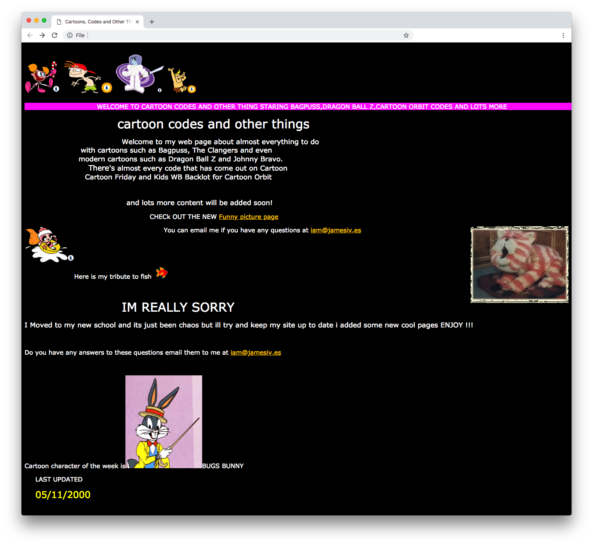

# Tooncrazy 📼
An archived version of the first website I ever built with my Dad in the year 1999 with [Microsoft Frontpage](https://en.wikipedia.org/wiki/Microsoft_FrontPage). The website served as a cartoon fansite, and eventually provided [Cartoon Orbit](https://en.wikipedia.org/wiki/Cartoon_Orbit) codes to other collectors in the year 2000.

The only changes made to the codebase are related to the email addresses as they no longer belonged to me.

[**You can view the website here**](http://tooncrazy.co.uk/).

## Notes 📎
* Includes `<marquee>` tags, [which are now obsolete](https://developer.mozilla.org/en-US/docs/Web/HTML/Element/marquee).
* `<applet>` tags used to be a way to embed Java applets into HTML documents, they are also [now obsolete](https://developer.mozilla.org/en-US/docs/Web/HTML/Element/applet).
* The `` tags have been obsolete [since HTML 4](https://developer.mozilla.org/en-US/docs/Web/HTML/Element/font).
* Instead of using proper styles, all of the spacing is made up of non-breaking spaces: `&nbsp;`.
* There's a number of inline attributes such as `bgcolor="#000000"` used which are also no longer supported.

## Dedicated to Dad ☕️
I owe a lot to my Dad, and not a day goes by where I don't miss him. Thank you for everything.

